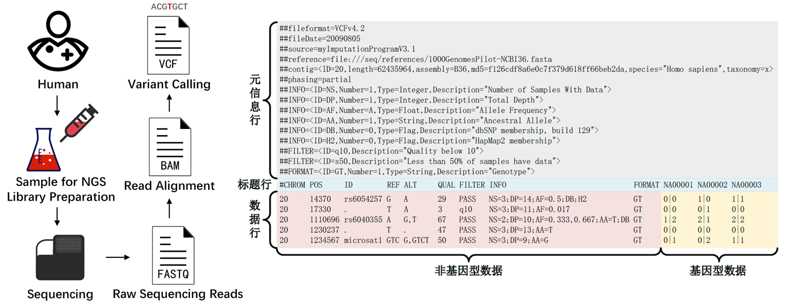
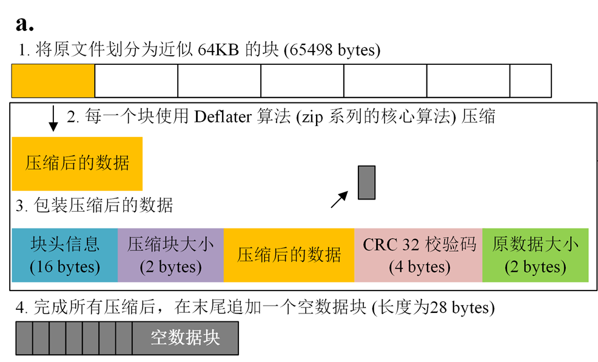
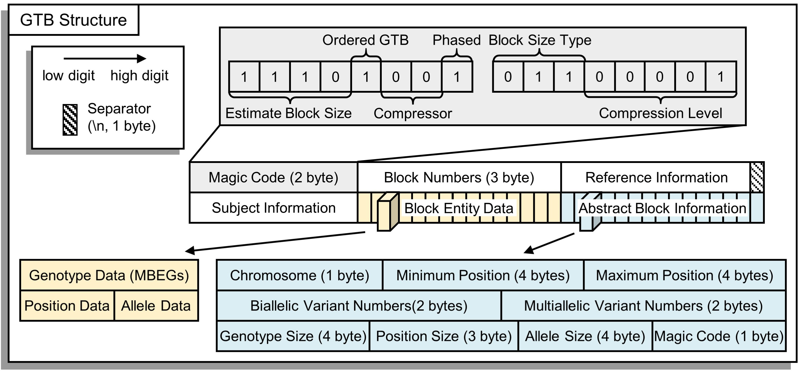

# Input and Output File Format

GBC supports the conversion between VCF format, compressed VCF format (by BGZIP), and GTB format. In general, we recommend user to use GTB as input and output format, which will get full multi-threaded support.
$$
\text{Other Formats}\Longleftrightarrow \text{VCF / compressed VCF (by BGZIP)}\Longleftrightarrow \text{GTB}
$$

| Input Format                    | Output Format                   | Tool             |
| :------------------------------ | :------------------------------ | :--------------- |
| Other Formats                   | VCF or VCF.GZ                   | Other tools      |
| VCF                             | compressed VCF                  | GBC - bgzip - -c |
| compressed VCF (by BGZIP)       | VCF                             | GBC - bgzip - -d |
| compressed VCF (by GZIP)        | VCF / compressed VCF (by BGZIP) | GBC - bgzip - -d |
| VCF / compressed VCF (by BGZIP) | GTB                             | GBC - build      |
| GTB                             | VCF / compressed VCF (by BGZIP) | GBC - extract    |

# VCF Format

VCF (Variant Call Format) is a standard format for storing variant sites, which is a text format specifically designed for recording and describing variant information such as SNP, InDel, SV, and CNV. 

> [!NOTE|label:For the details of the VCF file, we recommend reading: https://samtools.github.io/hts-specs/VCFv4.2.pdf and https://en.wikipedia.org/wiki/Variant_Call_Format]

# Compressed VCF with BGZIP

VCF files usually take up a large amount of disk space, so it is common to compress VCFs using BGZIP (the files produced using BGZIP compression are also called BGZF). BGZIP is a block compression method implemented on the standard GZIP file format, which aims to provide a good compression ratio while allowing random access to the data.

Java Implementation of Parallel BGZIP Compression Algorithm：http://pmglab.top/commandParser/en/example/BGZToolkit.html

> [!NOTE|label:About BGZIP: http://www.htslib.org/doc/bgzip.html]

# GTB Format

The GTB format is proposed for compressing and storing genotypes data of haploid and diploid species with various allele numbers, chromosome numbers, scales and phased or unphased statuses. It has the following excellent features:

- **Uniform:** In comparison to other file formats (e.g. GTShark, GTC, BGT, PBWT), GTB format has only separate files as output. In addition, it supports the organization of genotypes from multiple chromosomes within a single file (but not for PBWT). This facilitates file storage and transfer.
- **Decoupling:** GTB uses a decoupled design, allowing file modifications to involve as little data as possible. In addition, the independent structure feature makes parallelization computations very easy - parallelization by sites, block or chromosome can be easily implemented.
- **Extensible:** GTB is essentially a double-indexed key (chromosome, position) MDRT format, which is designed with a number of good easy-to-use API methods for fast random access to genotypes. MDRT allows variable multi-indexed keys with a similar structure to GTB, which is also used to store non-genotypic data in VCF files.

The file format of GTB is shown in the figure below. The meaning of each part is as follows:

- **Magic Code**: The first two bytes are used to store the compressed parameters; 
- **Block Numbers**: The total number of blocks contained in the compressed file, which also indicates that the "Block Abstract Information" at the end of the file has (25*numbers) bytes of memory; 
- **Reference Information**: The version of the reference genome and other reference data; 
- **Subjects Information**: List of subjects; 
- **Block Entity Data**: The compressed data is combined according to the order of the abstract block information; 
- **Abstract Block Information**: Abstract information of the GTB nodes for building first-level fast index table. 

