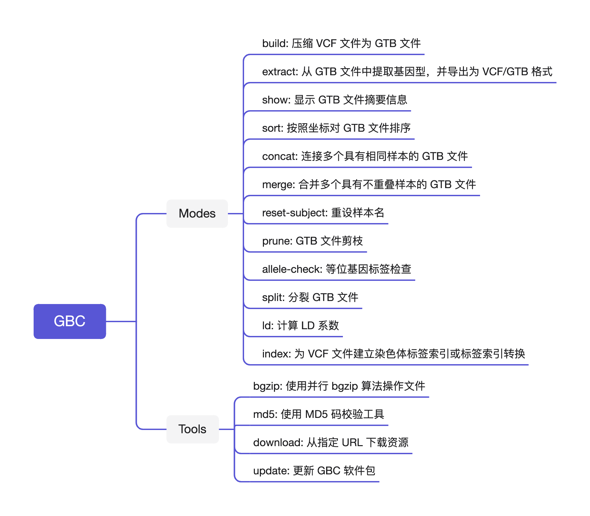

# About GBC

GBC (short for GenoType Blocking Compressor) is a blocking compressor for genotype data, which aims at creating a unified and flexible structure-GenoType Block (GTB) for genotype data in the variant call format (VCF) files. There will be a less occupation of hard disk space, a faster data access and extraction function, a more convenient management of population files and a more efficient precess of data analysis with the GTB structure compared with the conventional gz format. GBC provides the following functions：

- **Efficient compression:** Linearly increasing time overhead with sample and variant size, stable memory utilization and competitive compression ratio.
  - Memory: Single-threaded compression with < 4 GB memory usage.
  - Speed: up to 78516269 genotypes/s.

- **Quality control:** Quality control at variant-level, genotype-level, population-allele frequency/count-level. The open API facilitates users to customize their own filtering methods.
- **Quick query:** query continuous/random variants, filter variants by allele frequency/count, extract subset of samples, etc;
- **File management:** merge, join, split, subset sample selection, sorting, allele label checking, etc;
- **Complex calculations:** LD calculations.
- **Genotype coding for a wide range of haploid/diploid species**.

GBC is a free standalone toolkit for improved the efficiency of storage and file management of large-scale genotypes. GBC is also a library of fundamental API development tools that can be easily integrated into existing tool flows to accelerate the analysis and computation process of genotype-based data.

> [!COMMENT|label:Contact Developer]
>
> Liubin Zhang, suranyi.sysu@gmail.com
