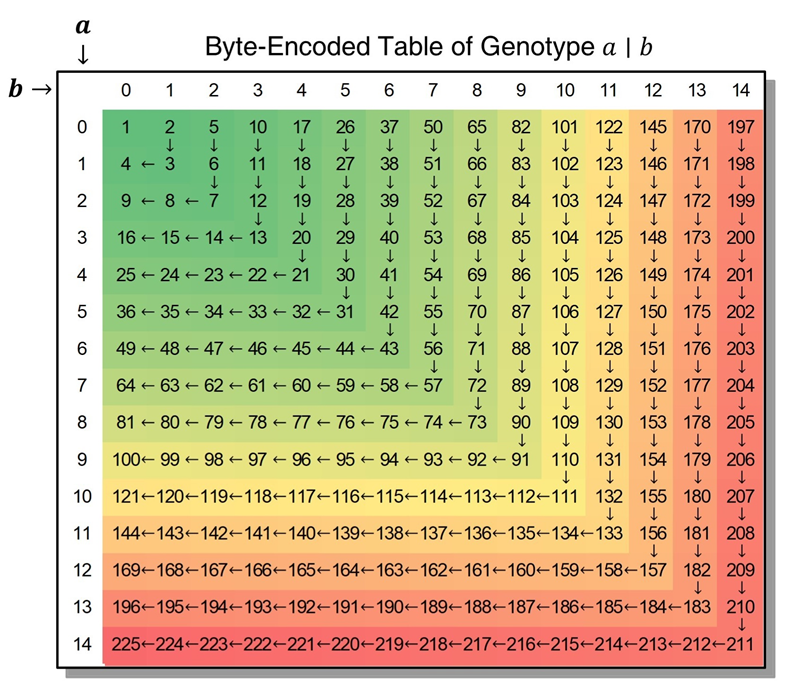
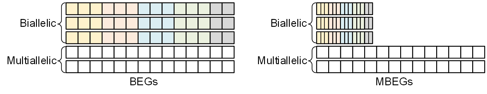

# Compress Genotypes {#BuildMode}

Use the following command to compress the genomic VCF file(s):

```bash
build <input(s)> -o <output> [options]
```

- GBC help compress the file in compliance with [VCF  Specification](https://samtools.github.io/hts-specs/VCFv4.2.pdf), and all GBC operations are based on the assumption that the file format is compliant with this specification.
- The inputFileName can be a single .vcf file or .vcf.gz file, and it can also be the path of the folder containing all the files to be compressed. When a folder path is given, the GBC will help filter out all .vcf or .vcf.gz files in this folder (and its sub-folders) for compression.
- The GBC currently only supports compression of the human genome, for chromosome, GBC only supports 1-22, X, Y and 1-22, X, Y with the "chr" prefix (such as chr1, chrY); For other species, please use command  `GBC index <input> -o <contigFile>`  to build the contig file first, and users should add the command `--contig <contigFile>` when compressing.
- When using GBC to combine and compress multiple files,  the files are required to have the same samples (can be disordered). If the sample of a file is a subset of other files, it can also be compressed correctly, and the missing genotypes will be replaced by `.|.`.
- When input files are unordered (in coordinates), GBC also compresses them correctly and produces GTB files marked as `unordered`. In general we recommend that users further sort this file using the `sort <input> -o <output> [options]` command, otherwise it will not work for some functions (e.g. calculating LD coefficients) or affect the performance of other operations (e.g. merging VCF files).

## Program Options {#Options}

```bash
Usage: build <input(s)> -o <output> [options]
Options:
  --contig      Specify the corresponding contig file.
                default: /contig/human/hg38.p13
                format: --contig <file> (Exists,File,Inner)
  *--output,-o  Set the output file.
                format: --output <file>
  --threads,-t  Set the number of threads.
                default: 4
                format: --threads <int> (>= 1)
  --yes,-y      Overwrite output file without asking.
GTB Archive Options:
  --phased,-p          Set the status of genotype to phased.
  --biallelic          Split multiallelic variants into multiple biallelic 
                       variants. 
  --simply             Delete the alternative alleles (ALT) with allele counts 
                       equal to 0.
  --blockSizeType,-bs  Set the maximum size=2^(7+x) of each block. (-1 means 
                       auto-adjustment) 
                       default: -1
                       format: --blockSizeType <int> (-1 ~ 7)
  --no-reordering,-nr  Disable the Approximate Minimum Discrepancy Ordering 
                       (AMDO) algorithm.
  --windowSize,-ws     Set the window size of the AMDO algorithm.
                       default: 24
                       format: --windowSize <int> (1 ~ 131072)
  --compressor,-c      Set the basic compressor for compressing processed data.
                       default: ZSTD
                       format: --compressor <string> ([ZSTD/LZMA/GZIP] or 
                       [0/1/2] (ignoreCase))
  --level,-l           Compression level to use when basic compressor works. 
                       (ZSTD: 0~22, 3 as default; LZMA: 0~9, 3 as default; 
                       GZIP: 0~9, 5 as default)
                       default: -1
                       format: --level <int> (-1 ~ 31)
  --readyParas,-rp     Import the template parameters (-p, -bs, -c, -l) from an 
                       external GTB file.
                       format: --readyParas <file> (Exists,File)
  --seq-ac             Exclude variants with the alternate allele count (AC) 
                       per variant out of the range [minAc, maxAc].
                       format: --seq-ac <int>-<int> (>= 0)
  --seq-af             Exclude variants with the alternate allele frequency 
                       (AF) per variant out of the range [minAf, maxAf].
                       format: --seq-af <double>-<double> (0.0 ~ 1.0)
  --seq-an             Exclude variants with the non-missing allele number (AN) 
                       per variant out of the range [minAn, maxAn].
                       format: --seq-an <int>-<int> (>= 0)
  --max-allele         Exclude variants with alleles over --max-allele.
                       default: 15
                       format: --max-allele <int> (2 ~ 15)
Quality Control Options:
  --no-qc     Disable all quality control methods.
  --gty-gq    Exclude genotypes with the minimal genotyping quality (Phred 
              Quality Score) per genotype < gq.
              default: 20
              format: --gty-gq <int> (>= 0)
  --gty-dp    Exclude genotypes with the minimal read depth per genotype < dp.
              default: 4
              format: --gty-dp <int> (>= 0)
  --seq-qual  Exclude variants with the minimal overall sequencing quality 
              score (Phred Quality Score) per variant < qual.
              default: 30
              format: --seq-qual <int> (>= 0)
  --seq-dp    Exclude variants with the minimal overall sequencing read depth 
              per variant < dp.
              default: 0
              format: --seq-dp <int> (>= 0)
  --seq-mq    Exclude variants with the minimal overall mapping quality score 
              (Mapping Quality Score) per variant < mq.
              default: 20
              format: --seq-mq <int> (>= 0)
```

## Example {#Examples}

Use the GBC to compress the example file `. /example/assoc.hg19.vcf.gz`, and set the following properties:

- Store the genotype as phased.
- Set compressor compression level  to 16 (ZSTD).
- Split multiallelic variants into multiple biallelic variants.
- Exclude variants with the MAF (minor allele frequency) < 0.01.
- Overwrite the output file if it already exists.

The commands to complete the task are as follows:

```bash
# Linux or MacOS
docker run -v `pwd`:`pwd` -w `pwd` --rm -it -m 4g gbc \
build ./example/assoc.hg19.vcf.gz -o ./example/assoc.hg19.gtb -p -l 16 --biallelic --seq-af 0.01-0.99 -y

# Windows
docker run -v %cd%:%cd% -w %cd% --rm -it -m 4g gbc build ./example/assoc.hg19.vcf.gz -o ./example/assoc.hg19.gtb -p -l 16 --biallelic --seq-af 0.01-0.99 -y
```

## Algorithm Details {#Algorithm}

At the beginning of compression, the input genotype file (in VCF format) is divided into several chunks and subsequently processed with multiple threads. In each thread, every chunk is further divided into many smaller blocks. Here, a block is the smallest unit of compression, in which the number of variants is balanced with the sample size given the maximal array length $$2^{31}  -1(\approx 2\text{GB})$$(Fig.a). Then, the genotypes of the variants are encoded into byte codes (Fig.b). For biallelic variants, their byte codes are further combined into one-byte codes by combining three phased or four unphased consecutive genotypes (Fig.c). Next, the approximate minimum discrepancy ordering (AMDO) algorithm is applied on the variant level (Fig.d) to sort the variants with similar genotype distributions for improving the compression ratio. The ZSTD algorithm is then adopted to compress the sorted data in each block (Fig.e). Finally, all the compressed blocks and metadata are written into a single GTB file (Fig.f). The procedure has a linear time complexity regarding the number of subjects and variants with small memory usage (less than 4GB), and it provides almost the fastest compression speed and the most competitive compression ratio to date.


### Input VCF File(s) for compression

One or multiple VCF files can be merged into a single GTB file. For a single input file, GBC reads the file directly. For an input of multiple files, GBC first treats the file with the largest sample size as the major file and uses it to build the sample primary indexes. Other input files will be handled in turns after matching the sample indexes of the major file. In the matching process, the genotypes of missing subjects will be set as '.|.' subsequently to ensure that all the input files can be compressed together consistently in subsequent steps.

> [!NOTE|label:Motivation]
>
> Various human genome projects (e.g. 1000GP3, SG10K) store genotypes according to different chromosome tags (i.e. chr1.gz, chr2.gz, ...). In addition, female individuals are usually not included in the Y chromosome files, resulting in Y chromosome files that usually have smaller sample sizes than autosomes or X chromosome files.
>
> This strategy allows for combining and compressing multiple scattered files of the genome, as well as combining and compressing sex chromosome files with autosomal files in the human genome.

### Initialization

To control the maximum memory usage per thread, when the total sample size $$M$$ is determined, the maximum number of variants per GTB block $$N$$ is also determined. Typically, the block size parameter (or number of variants in a block) corresponding to the sample size range is related as follows:

| Parameters | $$N$$ | $$M$$          | Parameters | $$N$$ | $$M$$ |
| :--------- | :--------- | :----------- | :--------- | :--------- | :------------- |
| -bs 7      | 16384      | $$\le 65536$$ | -bs 3      | 1024       | $$\le 1048576$$  |
| -bs 6      | 8192       | $$\le 131072$$ | -bs 2      | 512        | $$\le 2097152$$  |
| -bs 5      | 4096       | $$\le 262144$$ | -bs 1      | 256        | $$\le 4194303$$  |
| -bs 4      | 2048       | $$\le 524288$$ | -bs 0      | 64         | $$\le 16777215$$ |

### Chunking Inputs

The input files are compressed sequentially. During compressing each file, it is approximately equally divided into $$k$$ blocks according to the number of parallel threads $$k$$, with each thread processing 1 block. When the input file is in BGZIP-compressed VCF format, the GBC checks the byte-data at the block boundaries and adjusts the pointers to ensure that all variants in the block are intact.

### Quality Control by Variant's Non-Genotypic Fields and Genotypic Fields

When processing a single block, the thread reads variant by row and parses the non-genotypic fields. Initial variant-level quality control (e.g., QC based on Phred Quality Score or Mapping Quality Score) is preformed by the non-genotypic fields, and when variant do not meet QC requirements, the thread continues to read the next variant (skipping the current variant).

Variant that satisfy variant-level QC are parsed for their genotypes. When the value of the locus `FORMAT` is `GT`, no genotype-level QC is performed; if the value also contains other key fields, the genotype is quality-controlled for each read (e.g., QC based on DP, GQ). When a genotype does not meet the QC requirements, the genotype is `. |. `.

### Byte-Encoded of Genotype  (BEG)

For a given variant $$v$$, the non-missing phased genotype $$a\mid b$$ will be encoded as:
$$
a \mid b \rightarrow \begin{cases}(a+1)^{2}-b & , a \geq b \\ b^{2}+a+1 & , a<b\end{cases}
$$

(1) For a missing genotype `.|.`, it is encoded to 0; 
(2) For an unphased genotype `a/b`, it is encoded as above after being transformed to $$\min\{a,b\}\mid\max\{a,b\}$$;
(3) For a genotype `a` (in a male's chromosome X and Y), it is encoded as above after being converted into `a|a`. 



### Write Variant to the Buffer of GTBWriter

When the genotypes of the variant are all encoded, the variant is transferred to the GTBWriter buffer to proceed to the subsequent compression step. In this step, the variant are subjected to additional filtering or conversion operations.

- If the parameter "--simply" is passed in: the ALT tag with an allele count of 0 will be removed.
- If the parameter "--biallelic" is passed in: the multiallelic variant will be split into multiple biallelic variants.
- If the variant-level QC is activated: the variant will be subjected to variant-level quality control and the variant be skipped when it does not meet QC requirements.

Once the GTBWriter buffer size does not reach the maximum number of variants in the GTB block $$N$$ or the chunk file is not finished reading, repeat the above variant read, quality control, encoding, and write buffer operations. Otherwise, perform the following compression session.

### Approximate minimum discrepancy ordering of variants (AMDO)

AMDO starts with extracting the genotype accumulated down-sampling features. Supposing that each block contains $$M$$ variants and $$N$$ subjects, a zero-count matrix is denoted as $$C = [c_{mn}]_{M\times N}$$, where $$c_{mn}$$ is the count of reference alleles (namely 0 alleles) of the $$m^\text{th}$$ variant for the $n^\text{th}$ subject. Then, the genotype vector of a variant $$m$$ $$C_m=[c_{m0},c_{m1},\cdots,c_{m(N-1)}]$$ is merged into a shorter s-element vector,
$$
C_{m}^{(l)}=\left[C_{m, 0}^{(l)}, C_{m, 1}^{(l)}, \cdots, C_{m, s-1}^{(l)}\right]
$$
where $$C_{m,i}^{(l)}$$ covers a maximum of $$l=\lceil N / s\rceil$$ consecutive genotypes and $$s$$ is 24 by default. Each element $$C_{m,i}^{(l)}$$ in the vector is defined as an accumulated count, i.e. :
$$
C_{m, i}^{(l)}=\sum_{j=i \cdot l}^{\min \{N-1,(i+1) l-1\}} \sum_{k=i \cdot l}^{j} c_{m k}= \begin{cases}\displaystyle\sum_{j=i \cdot l}^{(i+1) l-1}((i+1) l-j) c_{m j} & , i<s-1 \\ \displaystyle\sum_{j=i \cdot l}^{N-1}(N-j) c_{m j} & , i=s-1\end{cases}
$$
The accumulation helps discriminate genotype distribution effectively. All the variants in a block are divided into two groups, i.e., the biallelic and the multiallelic groups. In the biallelic variants group, the order of the variant $$v_i$$ and the biallelic variant $$v_j$$ is defined as the dictionary order of $$C_i^{(l)}$$ and $$C_j^{(l)}$$, which are described as below:

- If $$\exists k_{0} \in\left[0,\left\lceil\frac{N}{s}\right\rceil-1\right], \forall k \in\left[0, k_{0}-1\right]$$, such that $$C_{i, k_{0}}^{(s)}<C_{j, k_{0}}^{(s)}, C_{i, k}^{(s)}=C_{j, k}^{(s)}$$, then $$v_{i}>v_{j}$$；
- If $$\exists k_{0} \in\left[0,\left\lceil\frac{N}{s}\right\rceil-1\right], \forall k \in\left[0, k_{0}-1\right]$$, such that $$C_{i, k_{0}}^{(s)}>C_{j, k_{0}}^{(s)}, C_{i, k}^{(s)}=C_{j, k}^{(s)}$$, then $$v_{i}<v_{j}$$；
- If $$\forall k \in\left[0,\left\lceil\frac{N}{s}\right\rceil-1\right]$$, such that $$C_{i, k}^{(s)}=C_{j, k}^{(s)}$$, then $$v_{i}=v_{j}$$。

On the contrary, the order will be inverted for multiallelic variants, which helps maximize the length of similar genotype vectors. Finally, the corresponding information of positions, alleles and MBEGs for variants are sorted according to the ordered variants ($$I=[m_0,m_1,\cdots,m_{M-1}]$$). 

### Maximized Byte-Encoded of Genotype (MBEG)

For biallelic variants, we further combine 3(phased)~4(unphased) multiple consecutive BEG codes into a single byte as follow:
$$
\begin{array}{ll}
\text{phased}: \left[\text{BEG}_{0}, \text{BEG}_{1}, \text{BEG}_{2}\right] \rightarrow 5^{2} \cdot \text{BEG}_{0}+5 \cdot \text{BEG}_{1}+\text{BEG}_{2} \\
\text{unphased}: \left[\text{BEG}_{0}, \text{BEG}_{1}, \text{BEG}_{2}, \text{BEG}_{3}\right] \rightarrow 4^{3} \cdot \text{BEG}_{0}+4^{2} \cdot \text{BEG}_{1}+4 \cdot \text{BEG}_{2}+\text{BEG}_{3}
\end{array}
$$

When the number of genotypes at a variant does not constitute a multiple of 3 or 4, the "null genotype" at the end will be set to the same as the previous one, i.e., $$\text{BEG}_i=\text{BEG}_{i-1} (\text{if } i\ge 1)$$.



### Merge data stream after compressing with advanced compressors

All the sorted MBEG and BEG codes in each block are further compressed by advanced compressors. Popular compression algorithms (e.g., Gzip, LZMA and zlib) can achieve a compression ratio of 100x or more on genotypes. We chose the ZSTD (short for Zstandard[19]) by default because it provides the fastest speed with a similar compression ratio among the widely used compression algorithms. In detail, the byte codes of each variant are concatenated into a byte array $$B_1$$ directly. Next, the position of each variant is converted into 4 bytes, and then all variants' positions are concatenated into a byte array $$B_2$$. Finally, the alleles of all variants are concatenated into another byte array $$B_3$$  with a '/' delimiter. Then, these concatenated data $$B_1$$,$$B_2$$ and $$B_3$$ are compressed by the latest ZSTD to produce $$\hat{B}_1$$,$$\hat{B}_2$$ and $$\hat{B}_3$$ respectively. The data entity is a long vector composed of three sections of compressed data, including encoded genotypes, positions, alleles. Two types of information of each packed block, including abstract information and data entity, are subsequently written to the GTB file. The abstract information include the chromosome number (1 byte), minimum and maximum positions (4 bytes respectively), number of biallelic variants (2 bytes), number of multiallelic variants (2 bytes), length of $$\hat{B}_1$$ (4 bytes), length of $$\hat{B}_2$$ (3 bytes), length of $$\hat{B}_3$$ (4 bytes) and magic code (1 byte) in a block. 

GBC can be integrated with different compression algorithms. ZSTD and LZMA algorithms have been embedded to compress each uncoupled genotype block. We also reserve two types of compressors for developers to extend in the future.

### Finish Compression

When a thread completes compression, the block summary information is stitched into the thread's corresponding output file. Then, the file pointer is moved to the file header and the block header information is modified.

When all threads have completed compression, the GBC main program calls the `Concat` method to stitch the GTB files produced by each thread into a single GTB file.
