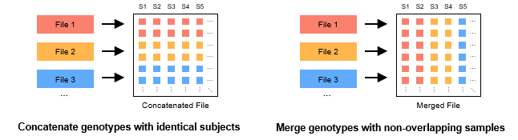

# Combine Multiple GTBs {#MergeGTBMode}

There are two main types of combining multiple GTB files: concatenation (concat, left panel) and merge (merge, right panel). The former is usually used to concatenate multiple single chromosome GTB files (e.g. chr1.gtb, chr2.gtb, ...), and the coordinates of these GTB files do not overlap with each other. The latter is usually used to combine genotypes from several different sequencing projects to increase the sample size of the study, and the samples of these GTB files do not overlap with each other.



## Concatenate multiple GTBs {#ConcatMode}

Use the following command to concatenate multiple GTBs (left panel):

```bash
concat <input(s)> -o <output> [options]
```

- When the input multiple files with the same status of genotype, compressor, and the samples, the operation of concatenation will be completed in seconds. Otherwise, GBC needs more time for file pre-conversion.
- The input files can be single or multiple .gtb files, or they can be the path to the folder containing them. When the path is a folder path, GBC will filter all .gtb files in that folder (and its subfolders) for concatenation. Note that GBC only determines the file type based on the file extension, so the correct file extension is the only one that can be concatenated.

### Program Options {#ConcatOptions}

```bash
Usage: concat <input(s)> -o <output> [options]
Options:
  --contig      Specify the corresponding contig file.
                default: /contig/human/hg38.p13
                format: --contig <file> (Exists,File,Inner)
  *--output,-o  Set the output file.
                format: --output <file>
  --yes,-y      Overwrite output file without asking.
```

### Example {#ConcatExamples}

Use the GBC to compress an example file that containing multiple chromosome `./example/simu100.coding.vcf.gz`:

```bash
# Linux or MacOS
docker run -v `pwd`:`pwd` -w `pwd` --rm -it -m 500m gbc \
build ./example/simu100.coding.vcf.gz -o ./example/simu100.coding.gtb -y

# Windows
docker run -v %cd%:%cd% -w %cd% --rm -it -m 500m gbc build ./example/simu100.coding.vcf.gz -o ./example/simu100.coding.gtb -y
```

Then, we split the GTB file into multiple single chromosome subfiles according to chromosome tags:

```bash
# Linux or MacOS
docker run -v `pwd`:`pwd` -w `pwd` --rm -it -m 500m gbc \
split ./example/simu100.coding.gtb -o ./example/simu100.coding --by chromosome

# Windows
docker run -v %cd%:%cd% -w %cd% --rm -it -m 500m gbc split ./example/simu100.coding.gtb -o ./example/simu100.coding --by chromosome
```

Finally, we use `concat` to concatenate all the GTB files in the `./example/simu100.coding` folder.

```bash
# Linux or MacOS
docker run -v `pwd`:`pwd` -w `pwd` --rm -it -m 500m gbc \
concat ./example/simu100.coding -o ./example/simu100.coding.concat.gtb

# Windows
docker run -v %cd%:%cd% -w %cd% --rm -it -m 500m gbc concat ./example/simu100.coding -o ./example/simu100.coding.concat.gtb
```

## Merge Multiple GTBs {#MergeMode}

Use the following command to merge multiple GTBs (right panel) from non-overlapping sample sets:

```
merge <input(s)> -o <output> [options]
```

- If the sample names of the files overlap, the sample names need to be reset using the `reset-subject` mode (see: [Reset the Subject Names](./reset-subject.md)).
- When no GTB archive format is set, the output GTB archive format defaults to same as the first incoming file.
- The input files can be single or multiple .gtb files, or they can be the path to the folder containing them. When the path is a folder path, GBC will filter all .gtb files in that folder (and its subfolders) for concatenation. Note that GBC only determines the file type based on the file extension, so the correct file extension is the only one that can be concatenated.

### Program Options {#MergeOptions}

```bash
Usage: merge <input(s)> -o <output> [options]
Options:
  --contig      Specify the corresponding contig file.
                default: /contig/human/hg38.p13
                format: --contig <file> (Exists,File,Inner)
  *--output,-o  Set the output file.
                format: --output <file>
  --threads,-t  Set the number of threads.
                default: 4
                format: --threads <int> (>= 1)
  --union       Method for handing coordinates in different files (union or 
                intersection, and intersection is the default), the missing 
                genotype is replaced by '.'.
  --yes,-y      Overwrite output file without asking.
GTB Archive Options:
  --phased,-p          Force-set the status of the genotype. (same as the GTB 
                       basic information by default)
                       format: --phased [true/false]
  --biallelic          Split multiallelic variants into multiple biallelic 
                       variants. 
  --simply             Delete the alternative alleles (ALT) with allele counts 
                       equal to 0.
  --blockSizeType,-bs  Set the maximum size=2^(7+x) of each block. (-1 means 
                       auto-adjustment) 
                       default: -1
                       format: --blockSizeType <int> (-1 ~ 7)
  --no-reordering,-nr  Disable the Approximate Minimum Discrepancy Ordering 
                       (AMDO) algorithm.
  --windowSize,-ws     Set the window size of the AMDO algorithm.
                       default: 24
                       format: --windowSize <int> (1 ~ 131072)
  --compressor,-c      Set the basic compressor for compressing processed data.
                       default: ZSTD
                       format: --compressor <string> ([ZSTD/LZMA/GZIP] or 
                       [0/1/2] (ignoreCase))
  --level,-l           Compression level to use when basic compressor works. 
                       (ZSTD: 0~22, 3 as default; LZMA: 0~9, 3 as default; 
                       GZIP: 0~9, 5 as default)
                       default: -1
                       format: --level <int> (-1 ~ 31)
  --readyParas,-rp     Import the template parameters (-p, -bs, -c, -l) from an 
                       external GTB file.
                       format: --readyParas <file> (Exists,File)
  --seq-ac             Exclude variants with the alternate allele count (AC) 
                       per variant out of the range [minAc, maxAc].
                       format: --seq-ac <int>-<int> (>= 0)
  --seq-af             Exclude variants with the alternate allele frequency 
                       (AF) per variant out of the range [minAf, maxAf].
                       format: --seq-af <double>-<double> (0.0 ~ 1.0)
  --seq-an             Exclude variants with the non-missing allele number (AN) 
                       per variant out of the range [minAn, maxAn].
                       format: --seq-an <int>-<int> (>= 0)
  --max-allele         Exclude variants with alleles over --max-allele.
                       default: 15
                       format: --max-allele <int> (2 ~ 15)
```

### Example {#MergeExamples}

Download the 1000GP3 dataset from `http://pmglab.top/genotypes` and store it in `./example/1000GP3` folder with the following path structure:

```
- 1000GP3
  - AFR
  - AMR
  - EAS
  - EUR
  - SAS
- randomsimu100000V_100S.chr1.vcf.gz
- rare.disease.hg19.vcf.gz
- query.txt
- query_1000GP3.txt
- simu100.coding.vcf.gz
- assoc.hg19.vcf.gz 
```

Use the GBC to compress genotype data for each population.

```bash
# Linux or MacOS
docker run -v `pwd`:`pwd` -w `pwd` --rm -it -m 4g gbc \
build ./example/1000GP3/AFR -o ./example/1000GP3/AFR.gtb -l 16 -p -y
docker run -v `pwd`:`pwd` -w `pwd` --rm -it -m 4g gbc \
build ./example/1000GP3/AMR -o ./example/1000GP3/AMR.gtb -l 16 -p -y
docker run -v `pwd`:`pwd` -w `pwd` --rm -it -m 4g gbc \
build ./example/1000GP3/EAS -o ./example/1000GP3/EAS.gtb -l 16 -p -y
docker run -v `pwd`:`pwd` -w `pwd` --rm -it -m 4g gbc \
build ./example/1000GP3/EUR -o ./example/1000GP3/EUR.gtb -l 16 -p -y
docker run -v `pwd`:`pwd` -w `pwd` --rm -it -m 4g gbc \
build ./example/1000GP3/SAS -o ./example/1000GP3/SAS.gtb -l 16 -p -y

# Windows
docker run -v %cd%:%cd% -w %cd% --rm -it -m 4g gbc build ./example/1000GP3/AFR -o ./example/1000GP3/AFR.gtb  -l 16 -p -y
docker run -v %cd%:%cd% -w %cd% --rm -it -m 4g gbc build ./example/1000GP3/AMR -o ./example/1000GP3/AMR.gtb  -l 16 -p -y
docker run -v %cd%:%cd% -w %cd% --rm -it -m 4g gbc build ./example/1000GP3/EAS -o ./example/1000GP3/EAS.gtb  -l 16 -p -y
docker run -v %cd%:%cd% -w %cd% --rm -it -m 4g gbc build ./example/1000GP3/EUR -o ./example/1000GP3/EUR.gtb  -l 16 -p -y
docker run -v %cd%:%cd% -w %cd% --rm -it -m 4g gbc build ./example/1000GP3/SAS -o ./example/1000GP3/SAS.gtb  -l 16 -p -y
```

Merge the GTB files of the 5 populations in the `1000GP3` folder:

```bash
# Linux or MacOS
docker run -v `pwd`:`pwd` -w `pwd` --rm -it -m 4g gbc \
merge ./example/1000GP3/AFR.gtb ./example/1000GP3/AMR.gtb ./example/1000GP3/EAS.gtb ./example/1000GP3/EUR.gtb ./example/1000GP3/SAS.gtb -o ./example/1000GP3.gtb -l 16 -p true -y

# Windows
docker run -v %cd%:%cd% -w %cd% --rm -it -m 4g gbc merge ./example/1000GP3/AFR.gtb ./example/1000GP3/AMR.gtb ./example/1000GP3/EAS.gtb ./example/1000GP3/EUR.gtb ./example/1000GP3/SAS.gtb -o ./example/1000GP3.gtb -l 16 -p true -y
```
