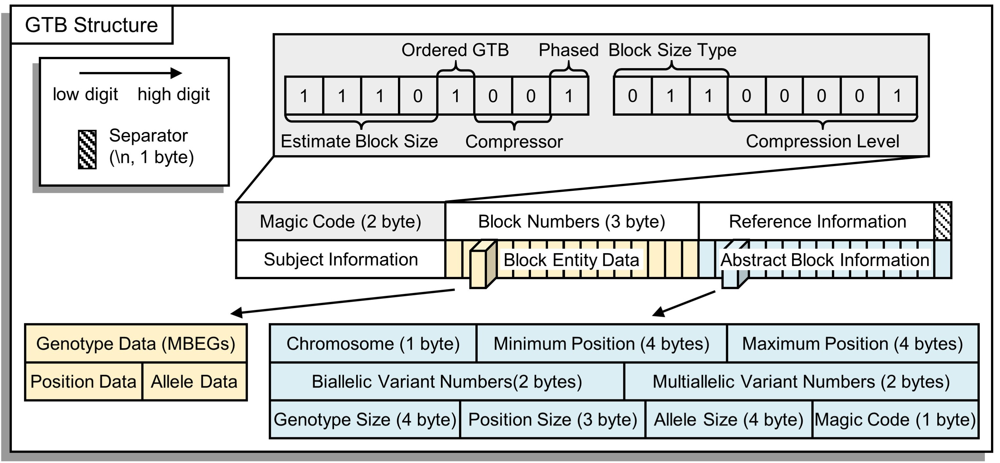

# 输入与输出格式

GBC 实现了 VCF 格式、BGZIP 压缩的 VCF 格式、GTB 格式之间的相互转换。通常情况下，我们建议使用 GTB 作为输入与输出，它将获得完全的多线程支持。
$$
\text{Other Formats}\Longleftrightarrow \text{VCF / BGZIP 压缩的 VCF}\Longleftrightarrow \text{GTB}
$$

| 输入格式               | 输出格式               | 支持工具         |
| :--------------------- | :--------------------- | :--------------- |
| 其他格式               | VCF 或 VCF.GZ          | 其他工具         |
| VCF                    | BGZIP 压缩的 VCF       | GBC - bgzip - -c |
| BGZIP 压缩的 VCF       | VCF                    | GBC - bgzip - -d |
| GZIP 压缩的 VCF        | VCF / BGZIP 压缩的 VCF | GBC - bgzip - -d |
| VCF / BGZIP 压缩的 VCF | GTB                    | GBC - build      |
| GTB                    | VCF / BGZIP 压缩的 VCF | GBC - extract    |

# VCF 格式

VCF（Variant Call Format）是存储变异位点的标准格式，它是专门用于记录和描述 SNP、InDel、SV 和 CNV 等变异信息的文本文件。VCF文件包含注释信息行、标题行、数据行。其中，注释信息行的行首为“##”，内容是键值对的形式，通常包含 VCF 文件版本信息、参考基因组信息、软件执行信息、相关字段含义等。标题行的行首为“#”，前9个字段都是固定的，分别为CHROM(染色体编号)、POS(变异位点在参考基因组中的位置)、ID(变异位点编号)、REF(参考碱基)、ALT(相对参考序列突变的碱基)、QUAL(变异位点的Phred-scaled质量分数)、FILTER(变异位点过滤状态)、INFO(附加信息)、FORMAT(样本数据格式)，之后若干列为样本名称；数据行中每一个变异位点占用一行，变异位点信息按照标题行顺序进行填写，使用制表符分割数据，缺失信息使用“.”占位。

> [!NOTE|label:VCF 文件格式: https://samtools.github.io/hts-specs/VCFv4.2.pdf]

# 使用 BGZIP 压缩的 VCF 格式

VCF 文件的文本格式通常占用庞大的磁盘空间，因此，使用 BGZIP 压缩 VCF  是常见的方法 (使用 BGZIP 压缩产生的文件也被称之为 BGZF)。BGZIP 是在标准 GZIP 文件格式之上实现的块压缩方法，它的目的是在提供良好的压缩比的同时，允许对数据进行随机访问 (即提取少量数据时，避免全文件解压)。

并行 BGZIP 压缩算法的 Java 实现：http://pmglab.top/commandParser/zh/example/BGZToolkit.html

> [!NOTE|label:BGZIP 文档: http://www.htslib.org/doc/bgzip.html]

# GTB 格式

GTB 是用于压缩和存储具有不同等位基因数、染色体数、单倍体和二倍体物种、Phased 和 Unphased 的、任意数量基因型数据的文件格式。它具有统一、灵活、可扩展的良好设计：

- **统一:** 与其他文件格式 (如 GTShark、GTC、BGT、PBWT) 对比，GTB 格式仅有单独的文件作为输出，同时它支持在一个文件内组织多个染色体的基因型数据 (与 PBWT 对比)。这有利于文件的储存和传输；
- **解耦:** GTB 使用解耦合设计，使得文件的修改尽可能只涉及到极少数的数据。此外，独立的结构特性也使得并行化变得非常容易——按位点、块或染色体进行并行化都可以很轻易地实现；
- **可扩展:** GTB 本质上是双索引键 (染色体、位置) 的 MDRT 格式，它为基因型的快速随机访问设计了许多良好易用的 API 方法。MDRT 允许具有可变的多索引键，并采用与 GTB 类似的结构，它也被用于储存 VCF 文件中的非基因型数据。

GTB 的文件格式如下图所示。各部分的含义如下：

- **Magic Code:** 文件的前 2 个字节是文件标记码 (Magic Code)，它表示了当前文件构建的基本细节，例如是否为有序的 GTB 文件、使用的基压缩器编码、基因型是否分向、GTB 块的最大位点容量 (也称块大小)、压缩级别等；
- **Block Numbers:** 文件的第 3～5 字节是文件中包含的 GTB 块的个数，它被以 3 字节整数的形式保存到文件中；
- **Reference Information:** 文件的参考序列地址，通常为指向公共资源或本地资源的 URL 地址；
- **Subject Information: **样本名称列表；
- **Block Entity Data: **块的压缩数据，基因型数据、位置数据、等位基因数据被分别压缩并拼接；
- **Abstract Block Information: **块摘要信息，描述了每个块对应的数据节点的基本信息 (如染色体编号、最小最大位置值、压缩数据段长度等)，用于创建 GTB 树表，实现快速访问。

