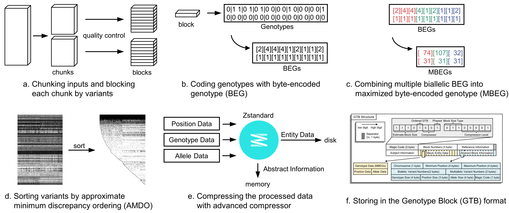

# 压缩基因型 {#BuildMode}

使用如下指令对基因组 VCF 文件进行压缩：

```bash
build <input(s)> -o <output> [options]
```

- GBC 可以为符合 [VCF 文件规范](https://samtools.github.io/hts-specs/VCFv4.2.pdf) 的文件进行压缩，GBC 的所有操作都是假定文件格式是符合此规范的；
- 输入文件可以是单个或多个 .vcf 文件或 .vcf.gz 文件，也可以是包含这些文件的文件夹路径。当路径为文件夹路径时，GBC 会筛选出该文件夹 (及其子文件夹) 中所有的 vcf 文件或 .vcf.gz 文件进行压缩。请注意，GBC 仅根据文件的扩展名判断文件类型，因此正确的文件扩展名才能够进行压缩；
- 为了便于统一全局的符号，GBC 当前仅支持对于人类基因组的压缩，CHROM当前只支持 1-22, X, Y, MT 以及带有 chr 前缀的 1-22, X, Y, MT；对于其他物种，需要先构建染色体标签文件；
- GBC 对多个文件进行合并压缩时，要求这些文件具有相同的样本序列 (样本顺序可以不一致)。若一个文件的样本序列是其他文件的子序列，它也可以被正确压缩，缺失的样本基因型将被替换为 .|.；
- 当输入的文件在坐标上无序时，GBC 也能正确地压缩，并产生标记为 `unordered` 的 GTB 文件。通常我们建议用户进一步使用 `sort <input> -o <output> [options]` 指令对该文件进行排序，否则它将在某些功能上不可用 (例如: 计算 LD 系数) 或影响其他操作的性能 (例如: 合并 VCF 文件)。

## 程序参数 {#Options}

```bash
语法: build <input(s)> -o <output> [options]
参数:
  --contig      指定染色体标签文件.
                默认值: /contig/human/hg38.p13
                格式: --contig <file> (Exists,File,Inner)
  *--output,-o  设置输出文件名.
                格式: --output <file>
  --threads,-t  设置并行压缩线程数.
                默认值: 4
                格式: --threads <int> (>= 1)
  --yes,-y      覆盖输出文件.
GTB 存档参数:
  --phased,-p          设置基因型数据为 phased.
  --biallelic          将多个多等位基因位点分裂为多个二等位基因位点.
  --simply             删除 ALT 中等位基因计数值为 0 的标签.
  --blockSizeType,-bs  设置每个压缩块的最大位点数, 根据 2^(7+x) 换算得到真实的块大小值.
                       默认值: -1 (即根据样本量自动设置)
                       格式: --blockSizeType <int> (-1 ~ 7)
  --no-reordering,-nr  禁用 Approximate Minimum Discrepancy Ordering (AMDO) 算法.
  --windowSize,-ws     设置 AMDO 算法的采样窗口大小.
                       默认值: 24
                       格式: --windowSize <int> (1 ~ 131072)
  --compressor,-c      设置基压缩器.
                       默认值: ZSTD
                       格式: --compressor <string> ([ZSTD/LZMA/GZIP] or 
                       [0/1/2] (ignoreCase))
  --level,-l           基压缩器的压缩级别. (ZSTD: 0~22, 默认为 3; LZMA: 0~9, 
                       默认为 3; GZIP: 0~9, 默认为 5)
                       默认值: -1
                       格式: --level <int> (-1 ~ 31)
  --readyParas,-rp     从外部 GTB 文件中导入模版参数 (-p, -bs, -c, -l).
                       格式: --readyParas <file> (Exists,File)
  --seq-ac             移除等位基因计数不在 [minAc, maxAc] 范围点的位点.
                       格式: --seq-ac <int>-<int> (>= 0)
  --seq-af             移除等位基因频率不在 [minAf, maxAf] 范围点的位点.
                       格式: --seq-af <double>-<double> (0.0 ~ 1.0)
  --seq-an             移除有效等位基因个数不在 [minAn, maxAn] 范围点的位点.
                       格式: --seq-an <int>-<int> (>= 0)
  --max-allele         移除等位基因种类超过指定值的位点.
                       默认值: 15
                       格式: --max-allele <int> (2 ~ 15)
质量控制参数:
  --no-qc     禁用所有的质量控制方法.
  --gty-gq    样本基因型 GQ 分数值小于指定值时, 该基因型将被替换为 '.|.'.
              默认值: 20
              格式: --gty-gq <int> (>= 0)
  --gty-dp    样本基因型 DP 分数值小于指定值时, 该基因型将被替换为 '.|.'.
              默认值: 4
              格式: --gty-dp <int> (>= 0)
  --seq-qual  移除 Phred Quality 分数值小于指定值的位点.
              默认值: 30
              格式: --seq-qual <int> (>= 0)
  --seq-dp    移除 DP 分数值小于指定值的位点. 
              默认值: 0
              格式: --seq-dp <int> (>= 0)
  --seq-mq    移除 MQ 分数值小于指定值的位点.
              默认值: 20
              格式: --seq-mq <int> (>= 0)
```

## 程序实例 {#Examples}

使用 GBC 压缩示例文件 `./example/assoc.hg19.vcf.gz`，并设置以下参数：

- 基因型设置为 phased；
- 压缩器压缩级别设置为 16；
- 将多等位基因位点分裂为二等位基因位点；
- 保留 MAF (次级等位基因频率) > 0.01 的位点；
- 若输出文件已存在，则覆盖该文件。

完成该任务的指令如下：

```bash
# Linux 或 MacOS
docker run -v `pwd`:`pwd` -w `pwd` --rm -it -m 4g gbc \
build ./example/assoc.hg19.vcf.gz -o ./example/assoc.hg19.gtb -p -l 16 --biallelic --seq-af 0.01-0.99 -y

# Windows
docker run -v %cd%:%cd% -w %cd% --rm -it -m 4g gbc build ./example/assoc.hg19.vcf.gz -o ./example/assoc.hg19.gtb -p -l 16 --biallelic --seq-af 0.01-0.99 -y
```

## 算法介绍 {#Algorithm}

GBC 压缩算法的流程分为分块、字节编码、最大化字节编码、位点的 AMDO 排序、使用基压缩器压缩数据流、储存到 GTB 文件。该算法对于样本和位点的数量具有线性时间复杂度，内存使用量小 (小于4GB) ，而且它提供了迄今为止几乎最快的压缩速度和最具竞争力的压缩比。



### 文件输入

多个文件输入时，GBC 将具有最多样本的文件作为母文件，其他的文件 (子文件) 的样本顺序则与母文件对齐。具体对齐策略如下：

- 当子文件的样本不包含在母文件中时，程序报错；
- 当子文件的样本顺序与母文件的样本顺序不一致时，子文件样本的基因型顺序将按照母文件的样本顺序进行重排；
- 当母文件的样本不包含在子文件中时，缺失的样本将以 `.|.` 或 `./.` 代替。

> [!NOTE|label:适用情形]
>
> 不少人类基因组项目 (如 1000GP3、SG10K) 都会将基因型按照不同染色体编号进行存放 (即 chr1.gz, chr2.gz, ...)。此外，在 Y 染色体文件中通常不包含雌性个体，造成 Y 染色体文件的样本数通常小于常染色体或 X 染色体。
>
> 这种策略可以将基因组的多个散布的文件合并压缩，也可以将人类基因组中的性染色体文件与常染色体文件合并压缩。

### 初始化

为控制每个线程的最大内存用量，当总样本量 $$M$$ 被确定时，每个 GTB 块的最大位点数 $$N$$ 也就被确定。通常情况下，样本量范围对应的块大小参数 (或块位点个数) 关系表如下：

| 参数 | $$N$$ | $$M$$          | 参数 | $$N$$ | $$M$$ |
| :--------- | :--------- | :----------- | :--------- | :--------- | :------------- |
| -bs 7      | 16384      | $$\le 65536$$ | -bs 3      | 1024       | $$\le 1048576$$  |
| -bs 6      | 8192       | $$\le 131072$$ | -bs 2      | 512        | $$\le 2097152$$  |
| -bs 5      | 4096       | $$\le 262144$$ | -bs 1      | 256        | $$\le 4194303$$  |
| -bs 4      | 2048       | $$\le 524288$$ | -bs 0      | 64         | $$\le 16777215$$ |

其中，$$M \times N\le 2^{30}$$。

### 文件分块以并行化

输入的文件依次进行压缩。在每个文件压缩时，按照并行线程数 $$k$$ 被近似地均等分成 $$k$$ 块，每个线程处理 1 个块。当输入文件为 BGZIP 压缩的 VCF 格式时，GBC 会检查块边界处的信息、调整指针，确保块中的位点都是完整的。

### 位点和基因型水平质控

线程在处理单个块时，按照行读取位点，并解析非基因型字段。通过非基因型字段预先进行初步的位点水平质量控制 (例如: 根据 Phred Quality Score、MQ 进行质控)，当位点不满足质控要求时，线程继续读取下一个位点。

满足位点水平质控的位点则对其基因型进行质控。当位点 `FORMAT` 的值为 `GT` 时，不进行基因型水平的质控；若该值还包含了其他的关键字段，则对于每一个读取的基因型将进行相应的质量控制 (例如: 根据 DP、GQ 进行质控)。当基因型不满足质控要求时，该基因型被 `.|.` 替代。

### 编码基因型为字节码 (BEG)

满足基因型水平质控的基因型进行字节编码。对于给定的位点 $$v$$, 非缺失基因型 $$a\mid b$$ 编码为：
$$
a \mid b \rightarrow \begin{cases}(a+1)^{2}-b & , a \geq b \\ b^{2}+a+1 & , a<b\end{cases}
$$

即：$$a \mid b \rightarrow(\max \{a, b\})^{2}+\max \{a-b, 0\}+a+1$$。对于特殊情形，约定如下: 

- 缺失基因型 $$.\mid.$$ 编码为 0；
- 非分相 (unphased) 基因型 $$a/b$$ 被转换为 $$\min\{a,b\}\mid\max\{a,b\}$$ 后按照上式编码；
- 单倍型 $$a$$ 被转换为 $$a\mid a$$ 后按照上式编码。


### 将位点写入 GTBWriter 缓冲区

当位点的基因型都被编码完成时，该位点被传输到 GTBWriter 缓冲区，以进入后续的压缩环节。在这一步，位点被执行更多的过滤或转换操作：

- 当启动了 “--simply” 时：多等位基因位点将移除等位基因计数为 0 的 ALT 标签，基因型则根据新的等位基因标签重新编码为字节值；
- 当启动了 “--biallelic” 时：多等位基因位点被拆分为多个二等位基因位点；
- 当启动了位点水平质控时：该位点进行位点水平质量控制，当位点不满足质控要求时，该位点将被跳过；

当 GTBWriter 缓冲区大小没有达到 GTB 块的最大位点数 $$N$$ 或该分块文件没有读取结束时，重复进行以上的位点读取、质控、编码、写入缓冲区的操作；否则，进行以下的压缩环节。

### 基因型阵列进行特征重排列 (AMDO)

缓冲区中的位点按照如下方式进行重排列，以提升压缩比：

**Step 1:** 样本 $$n$$  在位点 $$m$$ 上的基因型的 "0" 等位基因个数, 记为 $$c_{mn}$$；

**Step 2:** 生成降采样序列 $$C_{m}^{(l)}=\left[C_{m, 0}^{(l)}, C_{m, 1}^{(l)}, \cdots, C_{m, s-1}^{(l)}\right]$$, 其中:
$$
C_{m, i}^{(l)}=\sum_{j=i \cdot l}^{\min \{N-1,(i+1) l-1\}} \sum_{k=i \cdot l}^{j} c_{m k}= \begin{cases}\displaystyle\sum_{j=i \cdot l}^{(i+1) l-1}((i+1) l-j) c_{m j} & , i<s-1 \\ \displaystyle\sum_{j=i \cdot l}^{N-1}(N-j) c_{m j} & , i=s-1\end{cases}
$$
式中 $$N$$ 为总样本数, $$l=\lceil N / s\rceil$$ 为连续采样基因型的个数；

**Step 3:** 根据降采样序列, 二等位基因 (biallelic) 位点进行正向字典序排序。多等位基因 (multiallelic) 位点进行反向字典序排序。位点 $$v_i$$ 和位点 $$v_j$$ 的顺序被定义为 $$C_i^{(l)}$$ 和 $$C_j^{(l)}$$ 的字典序，即：

- 如果 $$\exists k_{0} \in\left[0,\left\lceil\frac{N}{s}\right\rceil-1\right], \forall k \in\left[0, k_{0}-1\right]$$, 使得 $$C_{i, k_{0}}^{(s)}<C_{j, k_{0}}^{(s)}, C_{i, k}^{(s)}=C_{j, k}^{(s)}$$, 则 $$v_{i}>v_{j}$$；
- 如果 $$\exists k_{0} \in\left[0,\left\lceil\frac{N}{s}\right\rceil-1\right], \forall k \in\left[0, k_{0}-1\right]$$, 使得 $$C_{i, k_{0}}^{(s)}>C_{j, k_{0}}^{(s)}, C_{i, k}^{(s)}=C_{j, k}^{(s)}$$, 则 $$v_{i}<v_{j}$$；
- 如果 $$\forall k \in\left[0,\left\lceil\frac{N}{s}\right\rceil-1\right]$$, 使得 $$C_{i, k}^{(s)}=C_{j, k}^{(s)}$$, 则 $$v_{i}=v_{j}$$。

最终，获得位点的新索引 $$I=\left[m_{0}, m_{1}, \cdots, m_{M-1}\right]$$。

### 将基因型字节码 (BEG) 转为最大化字节码 (MBEG)

对于二等位基因 (biallelic) 位点, 连续的 3~4 个基因型按照以下方法组合为单个字节:
$$
\begin{array}{ll}
\text{phased}: \left[\text{BEG}_{0}, \text{BEG}_{1}, \text{BEG}_{2}\right] \rightarrow 5^{2} \cdot \text{BEG}_{0}+5 \cdot \text{BEG}_{1}+\text{BEG}_{2} \\
\text{unphased}: \left[\text{BEG}_{0}, \text{BEG}_{1}, \text{BEG}_{2}, \text{BEG}_{3}\right] \rightarrow 4^{3} \cdot \text{BEG}_{0}+4^{2} \cdot \text{BEG}_{1}+4 \cdot \text{BEG}_{2}+\text{BEG}_{3}
\end{array}
$$

当位点基因型的个数不构成 3 或 4 的倍数时, 末尾处的"缺失基因型"被设置为上一个非缺失值. 


### 合并数据流并压缩

每个区块中的所有排序的 MBEG 和 BEG 代码都由先进的压缩器进一步压缩。流行的压缩算法（如 ZSTD、LZMA、GZIP 等）在基因型上可以达到 100 倍以上的压缩率。我们默认选择了ZSTD，因为在广泛使用的压缩算法中，它提供了最快的压解速度。

具体而言，每个位点的基因型编码都直接串联成一个字节数组 $$B_1$$。接下来，每个位点的位置被转换为 4 个字节，然后块内所有位点的位置被串联到一个字节数组 $$B_2$$。最后，所有变体的等位基因被串联到另一个带有 `/` 分隔符的字节数组$$B_3$$。然后，这些串联的数据 $$B_1$$、$$B_2$$ 和 $$B_3$$ 被基压缩器压缩，分别产生 $$\hat{B}_1$$、$$\hat{B}_2$$ 和 $$\hat{B}_3$$，这三个部分组成了块的压缩数据。块数据会即时写入线程相应的输出文件。

此外，根据压缩情况，每个块对应产生一个摘要信息：染色体编号（1个字节）、最小和最大位置（分别为4个字节）、二等位基因位点的数量（2个字节）、多等位基因位点的数量（2个字节）、$$\hat{B}_1$$ 的长度（4个字节）、$$\hat{B}_2$$ 的长度（3个字节）、$$\hat{B}_3$$ 的长度（4个字节）和块的校验编码（1个字节）。摘要信息被写入线程的内存队列中。

GBC 可以与不同的压缩算法相结合。ZSTD、LZMA、GZIP 算法已被嵌入，我们还保留了 1 种类型的压缩器，供开发者在未来扩展。

### 完成压缩

当一个线程完成压缩时，块摘要信息被拼接到线程相应的输出文件，文件指针挪动到文件头部，并修改块头信息。

当所有的线程都完成压缩时，GBC 主程序调用 `Concat` 方法将每个线程产生的 GTB 文件拼接成一个整体的 GTB 文件。

