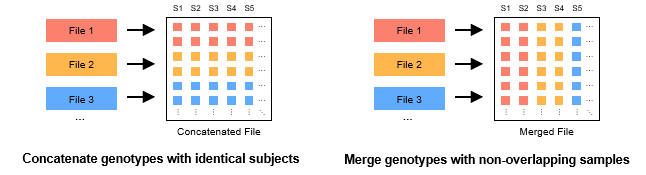

# 合并多个 GTB 文件 {#MergeGTBMode}

多个 GTB 文件的合并有两种主要类型：串联 (concat, 左图) 和合并 (merge, 右图)。前者通常用于连接多个单染色体的 GTB 文件 (如: chr1.gtb, chr2.gtb, ...)，这些 GTB 文件的位点之间不重叠。后者通常用于合并多个不同测序项目的基因型数据，以增大研究的样本量，这些 GTB 文件的样本之间不重叠。



## 串联多个 GTB 文件 {#ConcatMode}

使用如下指令连接多个具有相同样本的基因型 GTB 文件 (左图)：

```bash
concat <input(s)> -o <output> [options]
```

- 当输入的多个文件具有相同的基因型向型、压缩器索引、样本信息时，文件连接将在几秒内完成。不满足条件时，GBC 需要更多的时间进行文件的预转换。
- 输入文件可以是单个或多个 .gtb 文件，也可以是包含这些文件的文件夹路径。当路径为文件夹路径时，GBC 会筛选出该文件夹 (及其子文件夹) 中所有的 .gtb 文件进行连接。请注意，GBC 仅根据文件的扩展名判断文件类型，因此正确的文件扩展名才能够进行连接。

### 程序参数 {#ConcatOptions}

```bash
语法: concat <input(s)> -o <output> [options]
参数:
  --contig      指定染色体标签文件.
                默认值: /contig/human/hg38.p13
                格式: --contig <file> (Exists,File,Inner)
  *--output,-o  设置输出文件名.
                格式: --output <file>
  --yes,-y      覆盖输出文件.
```

### 程序实例 {#ConcatExamples}

使用 GBC 压缩包含多个染色体位点的示例文件 `./example/simu100.coding.vcf.gz`：

```bash
# Linux 或 MacOS
docker run -v `pwd`:`pwd` -w `pwd` --rm -it -m 500m gbc \
build ./example/simu100.coding.vcf.gz -o ./example/simu100.coding.gtb -y

# Windows
docker run -v %cd%:%cd% -w %cd% --rm -it -m 500m gbc build ./example/simu100.coding.vcf.gz -o ./example/simu100.coding.gtb -y
```

按照染色体编号拆分 `./example/simu100.coding.gtb` 文件：

```bash
# Linux 或 MacOS
docker run -v `pwd`:`pwd` -w `pwd` --rm -it -m 500m gbc \
split ./example/simu100.coding.gtb -o ./example/simu100.coding --by chromosome

# Windows
docker run -v %cd%:%cd% -w %cd% --rm -it -m 500m gbc split ./example/simu100.coding.gtb -o ./example/simu100.coding --by chromosome
```

连接 `./example/simu100.coding` 文件夹中的所有 GTB 文件：

```bash
# Linux 或 MacOS
docker run -v `pwd`:`pwd` -w `pwd` --rm -it -m 500m gbc \
concat ./example/simu100.coding -o ./example/simu100.coding.concat.gtb

# Windows
docker run -v %cd%:%cd% -w %cd% --rm -it -m 500m gbc concat ./example/simu100.coding -o ./example/simu100.coding.concat.gtb
```

## 合并多个 GTB 文件 {#MergeMode}

使用如下指令合并多个具有不重叠样本的基因型 GTB 文件 (右图)：

```bash
merge <input(s)> -o <output> [options]
```

- 输入文件可以是单个或多个 .gtb 文件，也可以是包含这些文件的文件夹路径。当路径为文件夹路径时，GBC 会筛选出该文件夹 (及其子文件夹) 中所有的 .gtb 文件进行连接。请注意，GBC 仅根据文件的扩展名判断文件类型，因此正确的文件扩展名才能够进行连接；
- 当文件的样本名存在重叠时，需要使用 `reset-subject` 方法重设样本名；
- 未设置 GTB 存档格式时，输出的 GTB 存档格式默认与第一个传入的文件一致。

### 程序参数 {#MergeOptions}

```bash
语法: merge <input(s)> -o <output> [options]
参数:
  --contig      指定染色体标签文件.
                默认值: /contig/human/hg38.p13
                格式: --contig <file> (Exists,File,Inner)
  *--output,-o  设置输出文件名.
                格式: --output <file>
  --threads,-t  设置并行压缩线程数.
                默认值: 4
                格式: --threads <int> (>= 1)
  --union       处理不同文件中的位点的策略 (默认为取交集, 传入 `--union` 时将取并集).
  --yes,-y      覆盖输出文件.
GTB 存档参数:
  --phased,-p          设置输出基因型的向型. (默认与输入的 GTB 文件向型一致)
                       格式: --phased [true/false]
  --biallelic          将多个多等位基因位点分裂为多个二等位基因位点.
  --simply             删除 ALT 中等位基因计数值为 0 的标签.
  --blockSizeType,-bs  设置每个压缩块的最大位点数根据 2^(7+x) 换算得到真实的块大小值.
                       默认值: -1 (即根据样本量自动设置)
                       格式: --blockSizeType <int> (-1 ~ 7)
  --no-reordering,-nr  禁用 Approximate Minimum Discrepancy Ordering (AMDO) 算法.
  --windowSize,-ws     设置 AMDO 算法的采样窗口大小.
                       默认值: 24
                       格式: --windowSize <int> (1 ~ 131072)
  --compressor,-c      设置基压缩器.
                       默认值: ZSTD
                       格式: --compressor <string> ([ZSTD/LZMA/GZIP] or 
                       [0/1/2] (ignoreCase))
  --level,-l           基压缩器的压缩级别. (ZSTD: 0~22, 默认为 3; LZMA: 0~9, 
                       默认为 3; GZIP: 0~9, 默认为 5)
                       默认值: -1
                       格式: --level <int> (-1 ~ 31)
  --readyParas,-rp     从外部 GTB 文件中导入模版参数 (-p, -bs, -c, -l).
                       格式: --readyParas <file> (Exists,File)
  --seq-ac             移除等位基因计数不在 [minAc, maxAc] 范围点的位点.
                       格式: --seq-ac <int>-<int> (>= 0)
  --seq-af             移除等位基因频率不在 [minAf, maxAf] 范围点的位点.
                       格式: --seq-af <double>-<double> (0.0 ~ 1.0)
  --seq-an             移除有效等位基因个数不在 [minAn, maxAn] 范围点的位点.
                       格式: --seq-an <int>-<int> (>= 0)
  --max-allele         移除等位基因种类超过指定值的位点.
                       默认值: 15
                       格式: --max-allele <int> (2 ~ 15)
```

### 程序实例 {#MergeExamples}

从 `http://pmglab.top/genotypes` 下载 1000GP3 数据集，按照不同的群体分别存放在 `./example/1000GP3` 文件夹下，路径结构如下：

```bash
- 1000GP3
  - AFR
  - AMR
  - EAS
  - EUR
  - SAS
- randomsimu100000V_100S.chr1.vcf.gz
- rare.disease.hg19.vcf.gz
- query.txt
- query_1000GP3.txt
- simu100.coding.vcf.gz
- assoc.hg19.vcf.gz 
```

使用 GBC 压缩每个群体的基因型数据：

```bash
# Linux 或 MacOS
docker run -v `pwd`:`pwd` -w `pwd` --rm -it -m 4g gbc \
build ./example/1000GP3/AFR -o ./example/1000GP3/AFR.gtb -l 16 -p -y
docker run -v `pwd`:`pwd` -w `pwd` --rm -it -m 4g gbc \
build ./example/1000GP3/AMR -o ./example/1000GP3/AMR.gtb -l 16 -p -y
docker run -v `pwd`:`pwd` -w `pwd` --rm -it -m 4g gbc \
build ./example/1000GP3/EAS -o ./example/1000GP3/EAS.gtb -l 16 -p -y
docker run -v `pwd`:`pwd` -w `pwd` --rm -it -m 4g gbc \
build ./example/1000GP3/EUR -o ./example/1000GP3/EUR.gtb -l 16 -p -y
docker run -v `pwd`:`pwd` -w `pwd` --rm -it -m 4g gbc \
build ./example/1000GP3/SAS -o ./example/1000GP3/SAS.gtb -l 16 -p -y

# Windows
docker run -v %cd%:%cd% -w %cd% --rm -it -m 4g gbc build ./example/1000GP3/AFR -o ./example/1000GP3/AFR.gtb  -l 16 -p -y
docker run -v %cd%:%cd% -w %cd% --rm -it -m 4g gbc build ./example/1000GP3/AMR -o ./example/1000GP3/AMR.gtb  -l 16 -p -y
docker run -v %cd%:%cd% -w %cd% --rm -it -m 4g gbc build ./example/1000GP3/EAS -o ./example/1000GP3/EAS.gtb  -l 16 -p -y
docker run -v %cd%:%cd% -w %cd% --rm -it -m 4g gbc build ./example/1000GP3/EUR -o ./example/1000GP3/EUR.gtb  -l 16 -p -y
docker run -v %cd%:%cd% -w %cd% --rm -it -m 4g gbc build ./example/1000GP3/SAS -o ./example/1000GP3/SAS.gtb  -l 16 -p -y
```

合并 `1000GP3` 文件夹下的 5 个群体的 GTB 文件:

```bash
# Linux 或 MacOS
docker run -v `pwd`:`pwd` -w `pwd` --rm -it -m 4g gbc \
merge ./example/1000GP3/AFR.gtb ./example/1000GP3/AMR.gtb ./example/1000GP3/EAS.gtb ./example/1000GP3/EUR.gtb ./example/1000GP3/SAS.gtb -o ./example/1000GP3.gtb -l 16 -p true -y

# Windows
docker run -v %cd%:%cd% -w %cd% --rm -it -m 4g gbc merge ./example/1000GP3/AFR.gtb ./example/1000GP3/AMR.gtb ./example/1000GP3/EAS.gtb ./example/1000GP3/EUR.gtb ./example/1000GP3/SAS.gtb -o ./example/1000GP3.gtb -l 16 -p true -y
```
