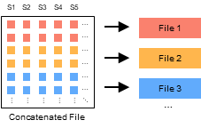

# 分裂 GTB 文件 {#SplitMode}

使用如下指令分裂 GTB 文件为多个独立的子文件：

```bash
split <input> -o <output> [options]
```



## 程序参数 {#Options}

```bash
语法: split <input> -o <output> [options]
参数:
  --contig      指定染色体标签文件.
                默认值: /contig/human/hg38.p13
                格式: --contig <file> (Exists,File,Inner)
  *--output,-o  设置输出文件名.
                格式: --output <file>
  --by          按照染色体水平/节点水平分裂 GTB 文件为多个子文件. 
                默认值: chromosome
                格式: --by <string> ([chromosome/node] or [0/1])
  --yes,-y      覆盖输出文件.
```

## 程序实例 {#Examples}

按照染色体编号拆分 `./example/1000GP3.gtb` 文件：

```bash
# Linux 或 MacOS
docker run -v `pwd`:`pwd` -w `pwd` --rm -it -m 500m gbc \
split ./example/1000GP3.gtb -o ./example/1000GP3-chr -y

# Windows
docker run -v %cd%:%cd% -w %cd% --rm -it -m 500m gbc split ./example/1000GP3.gtb -o ./example/1000GP3-chr -y
```

运行该指令后，文件夹 `1000GP30-chr` 中产生 24 个 GTB 子文件。
