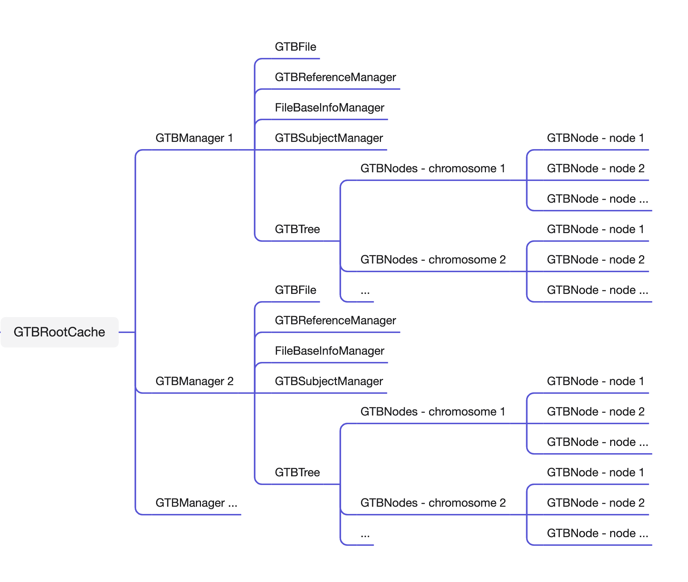

# GTB 组件

当一个 GTB 文件被创建或加载时，内存空间将初始化以下对象：

- GTBNode: 单个 GTB 节点的摘要信息对象；
- GTBNodes: 所有具有相同染色体编号的节点摘要信息对象，也称为染色体节点信息对象；
- GTBTree: 同一个文件所有的染色体节点信息对象；
- GTBFile: 指向文件在本地磁盘中的真实路径；
- GTBReferenceManager: 参考序列信息管理器，通常只保留字符串信息；
- FileBaseInfoManager: GTB 文件基本信息管理器，储存和管理文件的前 2 字节的关键对象；
- GTBSubjectManager: GTB 文件的样本序列，包含样本的包含性测试、检索与反检索等功能；
- GTBManager: GTB 文件管理器，一个 GTB 文件对应一个 GTB 管理器。包含节点信息 (GTBTree)、文件链接 (File)、参考序列信息 (GTBReferenceManager)、文件基本信息 (FileBaseInfoManager)、样本信息 (GTBSubjectManager)；
- GTBRootCache: 在一次程序运行期间所有加载的 GTBManager 对象缓冲区。

